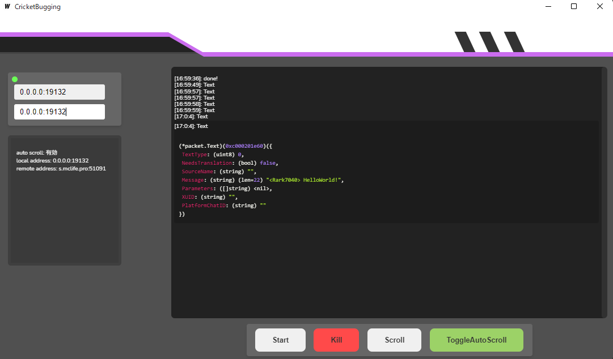

<samp>

# CricketBugging

[GopherTunnel](https://github.com/Sandertv/gophertunnel)を使用した、 パケットダンプ用のGUIアプリケーション

   

> **Warning**
> 現在調整中なのでTextPacketにしか対応していません

 
 
 

 
 
 

## ・Build
> **Warning**  
> [Wails](https://wails.io/ja/) のインストールが必要です

### Windows
1. `git clone https://github.com/Rark7040/CricketBugging.git`
2. `cd CricketBugging`
3. `wails build`
    
    
</samp>

